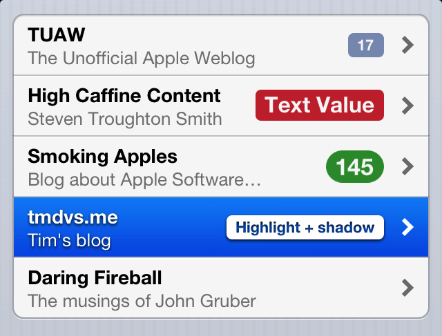
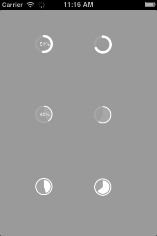
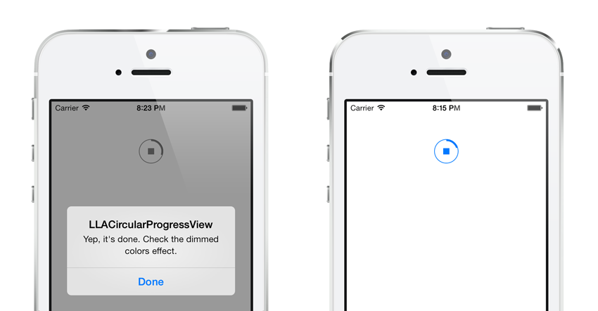

Vendors
=======

**The iOS Development vendors  collection**

- [Framework](#framework)
	- [MMDrawerController](#mmdrawercontroller) ❤
	- [AMSlideMenu](#amslidemenu) ❤
	- [MSDynamicsDrawerViewController](#msdynamicsdrawerviewcontroller)
	- [MWPhotoBrowser](#mwphotobrowser)
	- [ChameleonFramework](#chameleonframework)
	- [RSDayFlow](#rsdayflow)
- [Networking](#networking)
	- [AFNetworking](#afnetworking) ❤
	- [Reachability](#reachability)
	- [SDWebImage](#sdwebimage)
	- [UIActivityIndicator-for-SDWebImage](uiactivityIndicator-for-sdwebimage)
- [Object-Model-Persistence](#object-model-persistence)
	- [JSONModel](#jsonmodel) ❤
	- [FMDB](#fmdb) ❤
	- [TMCache](#tmcache)
	- [SSKeychain](#sskeychain)
- [Cocoa Extension](#cocoa-extension)
	- [BlocksKit](#blockskit) ❤
	- [NSStringEmojize](#nsstringemojize)
- [Refresh Control](#refresh-control)
	- [RefreshControl](#refreshcontrol) ❤
	- [ODRefreshControl](#odrefreshcontrol)
- [HUD](#hud)
	- [JGProgressHUD](#jgprogresshud) ❤
	- [MessageBanner](#messagebanner)
	- [TSMessages](#tsmessages)
	- [M13ProgressSuite](#m13progresssuite)
	- [AMPopTip](#ampoptip)
	- [CSNotificationView](#csnotificationview)
- [Graph](#graph)
	- [JBChartView](#jbchartview)
	- [TEAChart](#teachart)
- [Parallax](#Parallax)
	- [A3ParallaxScrollView](#a3parallaxscrollview)
	- [MDCParallaxView](#mdcparallaxview) ❤
	- [APParallaxHeader](#apparallaxheader) ❤
 	- [CHTwitterCover](#chtwittercover)
	- [XHPathCover](#xhpathcover)
	- [SWParallaxScrollView](#swparallaxscrollview)
	- [GKLParallaxPictures](#gklparallaxpictures)
	- [MPParallaxCollection](#mpparallaxcollection)
- [Animation](#animation)
	- [Shimmer](#shimmer)
	- [BCGenieEffect](#bcgenieeffect)
	- [AMWaveTransition](#amwavetransition)
- [IntroView](#introview)
	- [EAIntroView](#eaintroview) ❤
	- [MYBlurIntroductionView](#myblurintroductionview)
	- [onboard](#onboard)
	- [RMStepsController](#rmstepscontroller)
- [Control](#control)
	- [TTTAttributedLabel](#tttattributedlabel)
	- [M80AttributedLabel](#m80attributedlabel)
	- [HPGrowingTextView](#hpgrowingtextview)
	- [SDSegmentedControl](#sdsegmentedcontrol)
	- [DZNSegmentedControl](#dznsegmentedcontrol)
	- [FRDLivelyButton](#frdlivelybutton)
	- [TDBadgedCell](#tdbadgedcell)
	- [SWTableViewCell](#swtableviewcell)
	- [AMScrollingNavbar](#amscrollingnavbar)
	- [MDRadialProgress](#mdradialprogress) ❤
	- [LASIImageView](#lasiimageview)
	- [LLACircularProgressView](#llacircularprogressview)
	- [REMenu](#remenu)
	- [RSKImageCropper](#rskimagecropper)
	- [UzysAssetsPickerController](#uzysassetspickercontroller)
	- [QBImagePickerController](#qbimagepickercontroller)
- [Effect]
	- [CHTCollectionViewWaterfallLayout](#chtcollectionviewwaterfalllayout)
	- [iOS Realtimeblur](#ios-realtimeblur)
- [Function](#function)
	- [THContactPicker](#thcontactpicker)
	- [DAKeyboardControl](#dakeyboardcontrol)

### Framework

#### MMDrawerController ❤

[A lightweight, easy to use, Side Drawer Navigation Controller](https://github.com/mutualmobile/MMDrawerController)

	&nbsp;

#### AMSlideMenu ❤

[Sliding Menu for iOS (Left and Right menus).  Multiple storyboards and XIBs support.](https://github.com/SocialObjects-Software/AMSlideMenu)

	&nbsp;

#### MSDynamicsDrawerViewController

[Container view controller that leverages UIKit Dynamics to provide a realistic drawer navigation paradigm.](https://github.com/monospacecollective/MSDynamicsDrawerViewController)

	&nbsp;
	&nbsp;
	&nbsp;
	&nbsp;	
	

#### MWPhotoBrowser

[A simple iOS photo browser with optional grid view, captions and selections.](https://github.com/mwaterfall/MWPhotoBrowser.git)

	&nbsp;
	&nbsp;
	&nbsp;
	&nbsp;	

#### ChameleonFramework

[Chameleon is a port of Apple's UIKit for iOS (and some minimal related frameworks) to Mac OS X.
](https://github.com/BigZaphod/Chameleon)

#### RSDayFlow

[iOS 7 Calendar + Infinite Scrolling.](https://github.com/ruslanskorb/RSDayFlow)

	&nbsp;

### Networking

#### AFNetworking ❤

[A delightful iOS and OS X networking framework](https://github.com/AFNetworking/AFNetworking)

#### Reachability

[ARC and GCD Compatible Reachability Class for iOS and MacOS. Drop in replacement for Apple Reachability](https://github.com/tonymillion/Reachability.git)

#### SDWebImage

[Asynchronous image downloader with cache support with an UIImageView category](https://github.com/rs/SDWebImage.git)

#### UIActivityIndicator-for-SDWebImage

[The easiest way to add a UIActivityView to your SDWebImage view](https://github.com/JJSaccolo/UIActivityIndicator-for-SDWebImage.git)

#### Reachability

[ARC and GCD Compatible Reachability Class for iOS and MacOS. Drop in replacement for Apple Reachability](https://github.com/tonymillion/Reachability)

### Object-Model-Persistence

#### JSONModel ❤

[Magical Data Modelling Framework for JSON. Create rapidly powerful, atomic and smart data model classes](https://github.com/icanzilb/JSONModel)

####FMDB ❤

[A Cocoa / Objective-C wrapper around SQLite](https://github.com/ccgus/fmdb.git)

#### TMCache

[Fast parallel object cache for iOS and OS X.](https://github.com/tumblr/TMCache.git) 

#### SSKeychain

[Simple Objective-C wrapper for the keychain that works on Mac and iOS](https://github.com/soffes/sskeychain.git)

### Cocoa Extension

#### BlocksKit ❤

[The Objective-C block utilities you always wish you had.](https://github.com/zwaldowski/BlocksKit.git)

#### NSStringEmojize

[A category on NSString to convert Emoji Cheat Sheet codes to their equivalent Unicode characters](https://github.com/diy/NSStringEmojize.git)

### Refresh Control

#### RefreshControl ❤

[Pull to Refreshing, Built by Moch](https://github.com/showmecode/RefreshControl.git)

#### ODRefreshControl

[A pull down to refresh control like the one in Apple's iOS6 Mail App](https://github.com/Sephiroth87/ODRefreshControl.git)

	

### HUD

#### JGProgressHUD ❤

[Powerful, simple and modern progress HUD for iOS. This ProgressHUD supports iOS 5 - iOS 8.](https://github.com/JonasGessner/JGProgressHUD.git)

	&nbsp;
	&nbsp;
	&nbsp;
	

#### MessageBanner

[iOS Notification / Message easy to use and fully customisable](https://github.com/Loadex/MessageBanner.git)

	

#### TSMessages

[Easy to use and customizable messages/notifications for iOS à la Tweetbot](https://github.com/toursprung/TSMessages.git)

	&nbsp;
	

#### M13ProgressSuite

[A suite containing many tools to display progress information on iOS.](https://github.com/Marxon13/M13ProgressSuite.git)

	&nbsp;
	&nbsp;
	&nbsp;
	&nbsp;
	

#### AMPopTip

[An animated tooltip](https://github.com/andreamazz/AMPopTip.git)

	

#### CSNotificationView

[Drop-in, semi-translucent and blurring notification view.](https://github.com/problame/CSNotificationView)

	&nbsp;
	&nbsp;
		

### Graph

#### JBChartView
[iOS-based charting library for both line and bar graphs.](https://github.com/Jawbone/JBChartView.git)

	

#### TEAChart

[Simple and intuitive iOS chart library. Contribution graph, clock chart, and bar chart.](https://github.com/xhacker/TEAChart)

	&nbsp;
	&nbsp;
	

### Parallax

#### A3ParallaxScrollView

[A UIScrollview subclass with a high performance parallax scrolling effect](https://github.com/allaboutapps/A3ParallaxScrollView)

#### MDCParallaxView ❤

[Create a parallax effect using a custom container view, much like the top view of Path's timeline.](https://github.com/modocache/MDCParallaxView.git)

	

#### APParallaxHeader ❤

[Category that makes it super easy to add a parallax effect to your UIScrollView/UITableView](https://github.com/apping/APParallaxHeader.git)

#### CHTwitterCover

[TwitterCover is a parallax top view with real time blur effect to any UIScrollView, inspired by Twitter for iOS.](https://github.com/cyndibaby905/TwitterCover)

	

#### XHPathCover

[PathCover is pull down refresh and a parallax/zooming top view with real time blur effect to any UITableView, inspired by Path for iOS.](https://github.com/JackTeam/PathCover)

	&nbsp;
		

#### SWParallaxScrollView

[A UIScrollView subclass with multiple layers and a parallax effect.](https://github.com/5sw/SWParallaxScrollView.git)

#### GKLParallaxPictures

[Parallax ViewController made specifically for showcasing multiple images](https://github.com/pyro2927/GKLParallaxPictures.git)

	

#### MPParallaxCollection

[a collection view layout + cell that can do something percent driven ( parallax for image)](https://github.com/MP0w/MPParallaxCollection)

	

### Animation

#### Shimmer

[An easy way to add a simple shimmering effect to any view in an iOS app.](https://github.com/facebook/Shimmer)

	

#### BCGenieEffect

[An OSX style genie effect inside your iOS app.](https://github.com/Ciechan/BCGenieEffect)

	&nbps;
	&nbps;

#### AMWaveTransition

[Custom transition between viewcontrollers holding tableviews](https://github.com/andreamazz/AMWaveTransition)

	&nbps;

### IntroView

#### EAIntroView ❤

[Highly customizable drop-in solution for introduction views.](#https://github.com/ealeksandrov/EAIntroView)

	&nbps;
	&nbps;

#### MYBlurIntroductionView

[A super-charged version of MYIntroductionView for building custom app introductions and tutorials.](https://github.com/MatthewYork/MYBlurIntroductionView)

	&nbps;

#### Onboard

[Onboard provides developers with a quick and easy means to create a beautiful, engaging, and useful onboarding experience with only a few lines of code.](https://github.com/mamaral/Onboard)

	&nbps;
	&nbps;
	&nbps;

#### RMStepsController

[This is an iOS control for guiding users through a process step-by-step](https://github.com/CooperRS/RMStepsController)

	&nbps;

#### Control

#### TTTAttributedLabel

[A drop-in replacement for UILabel that supports attributes, data detectors, links, and more](https://github.com/mattt/TTTAttributedLabel)

- verticalAlignment
- textInsets
- firstLineIndent
- lineSpacing
- lineHeightMultiple
- shadowRadius
- highlightedShadowRadius | highlightedShadowOffset | highlightedShadowColor
- truncationTokenString

#### M80AttributedLabel

[Another attributed label using CoreText](https://github.com/xiangwangfeng/M80AttributedLabel)

- font
- textColor
- highlightColor
- linkColor
- underLineForLink
- numbersOfLines (Truncates Last Line Supported)
- textAligment
- lineBreakMode
- lineSpacing
- paragraphSpacing

#### HPGrowingTextView

[输入自动增加高度](https://github.com/yatinsns/HPGrowingTextView)

#### SDSegmentedControl

[A drop-in remplacement for UISegmentedControl that mimic iOS 6 AppStore tab controls](https://github.com/rs/SDSegmentedControl)

	

 #### DZNSegmentedControl

[A drop-in replacement for UISegmentedControl for showing counts, to be used typically on a user profile](https://github.com/dzenbot/DZNSegmentedControl)

	

#### FRDLivelyButton

[FRDLivelyButton is a simple UIButton subclass intended to be used inside a UIBarButtonItem, even though it can be used anywhere you can use a UIButton.](#https://github.com/sebastienwindal/FRDLivelyButton)

	

#### TDBadgedCell

[TDBadgedCell is a UITableViewCell subclass that adds badges, to table view cells. It's highly customisable, allowing you to alter the badge colours, shape, and positioning.](https://github.com/tmdvs/TDBadgedCell)

	

#### SWTableViewCell

[An easy-to-use UITableViewCell subclass that implements a swippable content view which exposes utility buttons (similar to iOS 7 Mail Application)](https://github.com/CEWendel/SWTableViewCell)

	&nbsp;
	&nbsp;
	;

#### AMScrollingNavbar

[Scrollable UINavigationBar that follows the scrolling of a UIScrollView](https://github.com/andreamazz/AMScrollingNavbar)

	&nbsp;

#### MDRadialProgress ❤

[A custom UIView useful to represent progress in discrete steps.](https://github.com/mdinacci/MDRadialProgress)

	&nbsp;

#### LASIImageView

[iOS UIImageView subclass - download image with different progress indicators](https://github.com/lukagabric/LASIImageView)

	&nbsp;

#### LLACircularProgressView

[An iOS7 style circular progress view with a stop button.](https://github.com/lipka/LLACircularProgressView)

	&nbsp;

#### REMenu

[Dropdown menu inspired by Vine.](https://github.com/romaonthego/REMenu)

	&nbsp;

#### RSKImageCropper

[An image cropper for iOS like in the Contacts app with support for landscape orientation.](https://github.com/ruslanskorb/RSKImageCropper)

	&nbsp;

#### UzysAssetsPickerController

[Alternative UIImagePickerController , You can take a picture with camera and pick multiple photos and videos](https://github.com/uzysjung/UzysAssetsPickerController)

	&nbsp;

#### QBImagePickerController

[A clone of UIImagePickerController with multiple selection support.](https://github.com/questbeat/QBImagePickerController)

### Effect

#### CHTCollectionViewWaterfallLayout

[The waterfall (i.e., Pinterest-like) layout for UICollectionView.](https://github.com/chiahsien/CHTCollectionViewWaterfallLayout)

	&nbsp;

#### iOS Realtimeblur

[Multipurpose real-time blur view, for iOS 6 and 7](https://github.com/alexdrone/ios-realtimeblur)

### Function 

#### THContactPicker

[An iOS view used for selecting contacts. This view is inspired by the contact selection in the iOS Mail and Messages apps](https://github.com/tristanhimmelman/THContactPicker)

#### DAKeyboardControl

[DAKeyboardControl allows you to easily add keyboard awareness and scrolling dismissal (a receding keyboard ala iMessages app) to any UIView, UIScrollView or UITableView with only 1 line of code. DAKeyboardControl automatically extends UIView and provides a block callback with the keyboard's current origin.](https://github.com/danielamitay/DAKeyboardControl)

